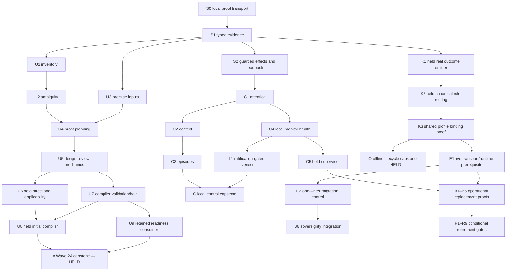

# Wave 2 technical plan — POSTW1-PLAN-011

The [dependency DAG](wave2-dependency-dag.json) is authoritative for this plan. The Phase 8 specifications remain requirement authority; the ten repaired design contracts have final disposition VERIFIED in Phase 10's `final_disposition` and `reverification_r2`. Earlier status fields are historical, not permission to ignore the five surviving authority gaps.

This is technical sequencing, not Phase 12 BIU decomposition or Phase 13 readiness assessment. Node IDs identify capability or proof gates, not workers or execution contracts. Nothing here creates or changes a requirement, closes an authority gap, authorizes implementation, or schedules a live retirement. Targeted coordinator review remains pending.

## Baseline and local custody

Baseline: `main` at `8b6e055415199e7355574af0a7bb54460aca644f`; Git identity `netmarine <sanuk.du@gmail.com>`. Source hashes are in the JSON. The existing program-state change introduces PLAN-011 as RUNNING; its supplied prompt and the untracked DAG checker/tests are matching task setup and were preserved. Only the two requested planning outputs are deliverables. No temporary branch/worktree was created. Outputs remain uncommitted in the repository worktree under the explicit no-commit/no-push instruction; coordinator review is the next handoff. This is not a LANDED or remotely verified result.

## Sequencing and ownership

Each planned capability has exactly one accountable **plan node**. This does not assign an unresolved product/domain owner: K1, K2 and C5 remain authority-blocked prerequisite slots. Their requirement IDs identify consumers, not permission to build missing infrastructure under SF-REQ-039. Product authority must identify existing requirement ownership and reviewed interfaces first. If the decision changes this structure, revise and review the affected DAG before implementing it. A favorable decision is never presumed.

S0 owns the local proof transports and durable fixture environment before any integration. S1 supplies typed evidence and neutral references; it does not import the inventory application. S2 supplies atomic guarded storage and the durable fenced consumer/readback before episodes and reconciliation. Existing SQLite methods alone do not implement the required fence semantics. No capstone can introduce a new transport, host, role router, outcome emitter, migration controller or proof adapter while claiming it is merely integrating.

Every `proof_requires_capabilities` entry is owned strictly upstream, including for non-capstones; self-ownership is not used to satisfy a prerequisite. A producer proves its newly owned output against upstream inputs. The list includes transitive substrate and proof receipts, so both paths and owners can be audited without interpreting prose. Capstones A, O and C integrate local capabilities; B6 integrates separately proven sovereignty prerequisites; R1–R9 are conditional retirement gates. All have their infrastructure upstream.



The diagram is a summary; `depends_on` in JSON contains the complete graph. In particular, U4 uses candidate design and pinned premise inputs; U5 then reviews that exact proof/design pair. U4 never calls final U5 applicability recursively. U6 holds only the direction-dependent extension/claims: existing checks and explicit ARCHITECTURE_AUTHORITY_HOLD probes continue at U5. Observed source imports and the withdrawn R1 table are not an approved import policy.

Generic C1 attention does not depend on 056. L1 consumes C1, so there is no 053/056 cycle. C4 local health values do not constitute C5 deployment supervision; an independent host observer must detect a dead process. Offline O uses the real shared kernel after K1/K2/K3, never a second scripted lifecycle. K1 emission must be proven before activating shared orchestration, and both actual sandbox/github constructors must prove prelaunch refusal without assigned authority/real sidecar binding. Local scripted outcomes cannot substitute for that real-worker-path probe.

## Authority holds and unaffected work

`authority_gap_refs` includes direct and inherited gaps on every dependent node. The five original gap records and resolution actors are preserved in the JSON. Completion of a gap-free helper cannot clear a dependent hold.

| Open authority gap | Direct waiting node | What continues independently |
|---|---|---|
| R2-GAP-051-EDGE-AUTHORITY | U6 | U5 existing architecture checks, review records and direction-dependent hold probes; no adopted edge table |
| R1-GAP-013-ALLOCATION | U8 | U7 validation and explicit allocation refusal; **A/Wave 2A completion stays blocked** |
| R1-GAP-039-REAL-OUTCOME | K1 | S0 current-interface/scripted fixtures; no claim of real sidecar emission |
| R1-GAP-039-ORCHESTRATION | K2, also transitively waiting on K1 | Current kernel fixtures only; no success-collapse replacement under 039 alone |
| R1-GAP-MONITOR-HOST | C5 | C1–C4 local services, fake timers and read-only health inspection; no live G+I guarantee |

Additional existing gates are distinct from those five gaps: POSTW1-DECIDE-004A G1/G2 assignment for U10; POSTW1-DECIDE-008A ratification for L1; POSTW1-DECIDE-006A and component-specific live handoff decisions; explicit future release/cutover, installation migration and programme completion authority. Gate labels describe required evidence, not newly invented product requirements or decisions already granted. L1 fixture/design preparation can continue conditionally, but this plan does not authorize implementing or adopting the unratified specification. No pending split/replan, durability, retry-budget or provider-normalization amendment is assumed.

## Parallel work

Five technical workstreams are recorded: substrate, upstream, control, lifecycle and replacement. These are not new Priority/Wave assignments or five simultaneously runnable workers. S0 precedes local tests; after S1, S2 and U1/U3 can progress independently. After S2, C1/C4 can advance alongside upstream proof/admission work. K1's preparation can proceed independently of upstream implementation, but actual changes wait on its authority decision. External custody/installation planning is independent of local integration subject to its own authority. `parallelisable_with` lists symmetric, dependency-independent pairs; it grants neither shared-file concurrent editing nor dual live writers.

## Node catalogue

Each node has one fixture group `FX-<id>` with concrete observables, evidence rules and exact acceptance/enforcement links in JSON. “PROCEEDS_REGARDLESS” means full bounded local scope is independent of the five gaps and separate unresolved authority gates, not that work has been executed. Every held node also states useful partial work.

| Node | Technical responsibility | Prerequisites | Completion status |
|---|---|---|---|
| S0 | Reusable isolated proof substrate | Root | PROCEEDS_REGARDLESS |
| S1 | Typed immutable evidence and neutral references | S0 | PROCEEDS_REGARDLESS |
| S2 | Atomic fencing and durable effect consumer journal | S0, S1 | PROCEEDS_REGARDLESS |
| U1 | Pinned requirements inventory and identifier classification | S1 | PROCEEDS_REGARDLESS |
| U2 | Ambiguity and attributed decision resolution | U1 | PROCEEDS_REGARDLESS |
| U3 | Pinned premise evidence bridge | S1 | PROCEEDS_REGARDLESS |
| U4 | Pre-implementation proof plans | U1, U2, U3 | PROCEEDS_REGARDLESS |
| U5 | Design admission and independent review mechanics | U2, U4 | PROCEEDS_REGARDLESS |
| U6 | Conditional direction-dependent design applicability | U5 | GAP_BLOCKED |
| U7 | Compiler validation and explicit allocation hold | U5 | PROCEEDS_REGARDLESS |
| U8 | Conditional initial compilation | U7, U6 | GAP_BLOCKED |
| U9 | Readiness lint and retained assessment consumer | U5, U7 | PROCEEDS_REGARDLESS |
| U10 | Externally assigned assessment transport boundary | U9 | SEPARATE_AUTHORITY_REQUIRED |
| A | Wave 2A upstream integration | U8, U9 | GAP_BLOCKED |
| C1 | Durable attention identity and resolution | S1, S2 | PROCEEDS_REGARDLESS |
| C2 | Durable context reconstruction | C1, U1 | PROCEEDS_REGARDLESS |
| C3 | Bounded episodes and stale-command refusal | C2, S2, U5 | PROCEEDS_REGARDLESS |
| C4 | Monitor ticks, scan health and trajectory seam | C1 | PROCEEDS_REGARDLESS |
| C5 | Conditional independently supervised monitor host | C4 | GAP_BLOCKED |
| L1 | Known-active liveness reconciliation | S2, C1, C4 | SEPARATE_AUTHORITY_REQUIRED |
| K1 | Conditional real-worker role outcome producer | S0, S1 | GAP_BLOCKED |
| K2 | Conditional canonical multi-role orchestration | K1, C1 | GAP_BLOCKED |
| K3 | Shared-profile role binding and compatibility proof | K2, U9 | GAP_BLOCKED |
| O | Offline multi-role lifecycle capstone | K3, S0, C1 | GAP_BLOCKED |
| C | Local bounded-control integration capstone | C3, C4, L1 | SEPARATE_AUTHORITY_REQUIRED |
| B0 | External bootstrap custody and consumer inventory | S0 | SEPARATE_AUTHORITY_REQUIRED |
| E1 | Existing canonical live transport prerequisite | B0, K3, S2 | GAP_BLOCKED |
| E2 | Conditional one-writer migration and rollback substrate | E1, C2 | GAP_BLOCKED |
| B1 | Operational trajectory replacement proof | B0, C5, S1, E1 | GAP_BLOCKED |
| B2 | Live liveness replacement proof | B0, L1, C5, K3, E1 | GAP_BLOCKED |
| B3 | Canonical live release admission proof | B0, A, U10, K3, E1 | GAP_BLOCKED |
| B4 | Successor program mailbox path proof | B0, C2, C3 | SEPARATE_AUTHORITY_REQUIRED |
| B5 | Human notification and attention consumer handoff proof | B0, C1, C5 | GAP_BLOCKED |
| B6 | Full sovereignty and reversible one-writer cutover proof | B3, B2, B1, B5, K3, E2 | GAP_BLOCKED |
| B7 | Installation launch-command migration proof | B0 | SEPARATE_AUTHORITY_REQUIRED |
| R1 | Replacement gate: coordinator checkpoint | B0, C2, C3 | SEPARATE_AUTHORITY_REQUIRED |
| R2 | Replacement gate: Program Director mailbox bridge waiter | R1, B4 | SEPARATE_AUTHORITY_REQUIRED |
| B8 | Attention waiter and resident tenure handoff gates | R1, R2, B5, C5 | GAP_BLOCKED |
| R3 | Replacement gate: SWF-29 liveness reconciliation | B2 | GAP_BLOCKED |
| R4 | Replacement gate: SWF-27 observer | B1 | GAP_BLOCKED |
| R5 | Replacement gate: attention queue | R3, R4, B8, C1 | GAP_BLOCKED |
| R6 | Replacement gate: bootstrap release-admission gate | B3 | GAP_BLOCKED |
| R7 | Replacement gate: Node/bootstrap execution authority | R6, R3, R4, R5, B6 | GAP_BLOCKED |
| R8 | Replacement gate: b-disp command compatibility alias | B7 | SEPARATE_AUTHORITY_REQUIRED |
| B9 | Programme completion or bounded successor custody | R2, B8 | GAP_BLOCKED |
| R9 | Replacement gate: Local Program Director bootstrap orchestration role | R2, B8, B9 | GAP_BLOCKED |

## Proof fixtures and coverage

The acceptance trace preserves all 53 acceptance IDs and the exact verified design probes. Eighteen enforcement opportunities retain their original BLOCKING/ADVISORY strength and promotion identities; they are not new controls. Fixture groups describe planned scenarios, not executed test files or passed results. U6 owns the conditional direction-dependent part of 051-AC-03; U5 still proves the existing mechanical checks and independent-review sequencing. U8's coverage requires actual authorized initial derivation: a fixture with hand-authored allocations is validation-only.

The fixtures deliberately include source manifests and exact identifier classes; immutable raw assessment envelopes and the retained PY-10 revision sequence; candidate/premise/proof revision vectors and independent reviewer identity; real temporary SQLite with multiple connections/processes; fsync/CAS crash points; unknown effect and late-sender journals; fake-clock boundaries; distinct fresh verifier invocation and retrieved Git candidate; and independent real-worker emission/binding probes with local transports. A deny-network fixture must demonstrate denial and absent credentials, not merely assert a zero counter. No tests or paid providers are launched by this plan.

Episode fixtures preserve the verified proposed defaults: one BIU, 3600 seconds, 32 transitions, 300 blocked seconds, one admitted contradiction, and any relevant vector mismatch. UNBOUND context observation disables only the numeric context threshold; BOUND observations must be same-invocation and current-check, with termination at 0.8 or invalid/unavailable evidence. Operator contradiction truth remains judgment. Liveness fixtures preserve G=300, I=60, C=90 as configurable design defaults, not historical canonical constants. At exactly 2*I health remains within bound; above it is stale. Failed scans are degraded, missing/regressing/unreadable observations unverified.

Every public composed operation must reach its real adapter/store path for success and typed failure. Intact/red/restored controls must fail the intended assertion when their guard is disabled; unrelated failure is not proof. Raw evidence stays private and immutable outside the repository; source definitions, observations and evaluator verdicts remain separate. No live proof, bootstrap retirement or operational detection bound is inferred from local fixture success.

## Bootstrap replacement sequence

The nine mechanisms below retain KEEP_UNTIL_REPLACED. All nine gate nodes require explicit component-specific operational authority and prior replacement proof; none schedules removal by date. JSON retains the complete 17-step source transition graph and exact release predicates, including conditions outside the nine. Dependencies are necessary, never authorization.

| Mechanism | Gate and immediate dependency path | Required protection before retirement |
|---|---|---|
| coordinator checkpoint | B0, C2, C3 → R1 | SF-REQ-053 durable project-owned context and a fresh invocation reconstructing authorized next actions, unresolved decisions and evidence from the same durable state; compare results before retiring the checkpoint as active input. |
| Program Director mailbox bridge waiter | R1, B4 → R2 | A tested program-message consumer in the successor episode or supported helper preserving request/reply identity, pending messages, handled attribution and duplicate suppression; or completed program with no outstanding duties. |
| SWF-29 liveness reconciliation | B2 → R3 | SF-REQ-056 or an authorized equivalent operating on the live workload: missing-effect detection, completed-outcome suppression, explicit resolution/supersession, durable fenced recovery, delayed-delivery duplicate safety and correlated outcome readback. |
| SWF-27 observer | B1 → R4 | Operational live-profile trajectory capture preserving identity, ordering, timestamps, anomalies, retention and consumption by an attention producer across process/session restart. |
| attention queue | R3, R4, B8, C1 → R5 | Durable attention ingestion/identity/deduplication, attribution, resolved-versus-seen semantics, replay and migration of pending and historical items; verified liveness consumer and SF-REQ-053 activation. Keep product decision authority separate. |
| bootstrap release-admission gate | B3 → R6 | Canonical live release admission enforcing all six preconditions plus eligibility before any launch, with meaningful negative controls and production-profile boundary evidence. |
| Node/bootstrap execution authority | R6, R3, R4, R5, B6 → R7 | Full sovereignty evidence, approved one-writer live-profile migration, active-work/effect reconciliation, backup and nonduplicating rollback; conformance S1–S7 is a design elaboration, not current operational proof. |
| b-disp command compatibility alias | B7 → R8 | Installation-by-installation proof that launch commands and integrations use alienintent; canonical command exists, but complete migration is unproven. Persisted B-DISP markers/IDs are not alias-removal targets. |
| Local Program Director bootstrap orchestration role | R2, B8, B9 → R9 | Complete or explicitly disposition approved program tasks, reviews, decision branches and final packet, then end the scoped role or obtain separately bounded continuation authority; preserve program state and evidence. |

B0 preserves the custody inventory and per-component decisions for all eighteen external modules before replacing their duties; filenames or reported test counts do not prove custody. E1 explicitly supplies live transport and an identified Node-independent runtime baseline before live integration. If absent, the existing owner must supply it under separately scoped authority; the capstone cannot build it as an incidental fixture. E2 proves one-writer migration, reconciliation and rollback control before B6 integrates sovereignty.

Checkpoint reconstruction R1 precedes mailbox R2. B5 separately covers the Windows notification decision, human receipt/response or explicit Founder risk acceptance, and product attention activation. B8 requires both these paths, independent hosting, explicit resident-tenure authority and SWF-21 scope disposition before session-waiter/resident handoff. Thus queue R5 cannot retire before waiter handoff, observer R4 and liveness R3. Queue history, pending identities, attribution and SEEN-versus-RESOLVED semantics are reconciled even if the queue happens to be empty.

Release R6 requires B3's six preconditions plus eligibility at the actual prelaunch boundary: durable implementation authorization, named exact baseline, real repository commit, ancestry from intended release point, no unsuperseded denial wording, and zero launches until those checks pass. Formal closure of SWF-21 neither removes this protection nor authorizes Wave 2 releases. U10's externally assigned assessment binding remains a prerequisite; retained-consumer tests alone do not supply it.

Node R7 waits for R6/R3/R4/R5 and B6. The ten selected contracts do not encompass every sovereignty obligation. B6 requires the full independently scoped sovereignty evidence, including existing operator, quality/evidence, isolation/budget and compatibility obligations; missing underlying implementation is returned to its existing authority, never silently assigned to this capstone. The S1–S7 candidate design is a source elaboration, not new ratification or permission to wire RAI. Cutover needs an explicit one-writer decision, full active-work/effect reconciliation and compatible, nonduplicating rollback. No concurrent Node/Python dispatch is permitted. Sandbox ingress contractual retention and production ingress remain separate decisions.

Alias R8 can be considered independently only after complete installation-by-installation canonical launch validation; persisted resource IDs/protocol markers never become alias-removal targets. Director R9 waits for mailbox/resident duties and B9's section-15 programme completion or explicitly bounded successor custody. It is not a permanent product orchestration capability, and Wave 2A or this plan alone cannot close it. PRODUCER profile reversion, sandbox tunnel disposition, Windows notification and other NEEDS_DECISION mechanisms retain their original source conditions; none is silently relabelled as one of the nine or executed here.

## Migrations

All migration objects are conditional plans, not performed transitions. New evidence, inventory and consumer payloads are additive schema-version-1 projections with immutable history and CAS pointers. Unsupported schema fails closed; no general upgrader, GC, authority transfer or external Agent-Ready schema is invented. The guarded store path keeps existing API compatibility while ensuring every participant in an adopted lane uses guarded admission. Shared role routing cannot activate before real outcome emission and both production constructors' binding probes. A future decision changing these fixed contracts requires design revision, not implementer discretion.

| Migration | Node | Mode |
|---|---|---|
| M-EVIDENCE | S1 | additive |
| M-FENCING | S2 | additive_guarded_path |
| M-INVENTORY | U1 | derived_projection |
| M-ASSESSMENT | U9 | consumer_only |
| M-ATTENTION | C1 | staged_import |
| M-CONTEXT | C2 | shadow_reconstruction |
| M-ROLE-BINDING | K3 | conditional_shared_profile_adoption |
| M-CUTOVER | E2 | conditional_one_writer |
| M-LAUNCH | B7 | installation_by_installation |
| M-R1 | R1 | retire_by_proven_replacement |
| M-R2 | R2 | retire_by_proven_replacement |
| M-R3 | R3 | retire_by_proven_replacement |
| M-R4 | R4 | retire_by_proven_replacement |
| M-R5 | R5 | retire_by_proven_replacement |
| M-R6 | R6 | retire_by_proven_replacement |
| M-R7 | R7 | retire_by_proven_replacement |
| M-R8 | R8 | retire_by_proven_replacement |
| M-R9 | R9 | retire_by_proven_replacement |

Retain immutable source snapshots, raw assessment attempts, identity aliases, pending attention and effect journals through migration. On failure keep the old protection; block only the affected transition. Unknown in-flight effects never justify lease theft or automatic replay. Rollback requires quiescence and reconciliation of both writers' accepted effects before either can resume.

## Targeted coordinator review

Review the conditional ownership slots K1/K2/C5 and U8 before assigning implementation; the U4/U5 acyclic premise-review ordering; the scope of U6's directional hold; all same-lane callers of S2's guarded store; real-path K3 compatibility before kernel activation; and E1/E2/B6's separation of live infrastructure from integration. Confirm that the selected designs cover each claimed replacement duty, and retain a hold where they do not. Review R5/R7/R9 for mailbox, Windows notification, session waiter, resident tenure, release-scope and programme-duty continuity. A checker pass cannot settle any of these judgments.

## Validation and limits

Required local commands (RTK proxy preserves unfiltered output and command status):

```bash
rtk proxy python3 tools/evidence/check_wave2_dag.py docs/evidence/wave2-dependency-dag.json
rtk proxy python3 tools/evidence/check_wave1.py --negative-controls
```

DAG check: PASS, 46 nodes, zero failures (exit 0). Wave 1 check: PASS, 1,075 checks, all 13/13 negative controls killed (exit 0). Validation results and computed counts are recorded in the JSON. Additional local artifact review checks exact selected requirement/AC coverage, unmodified enforcement strengths, unique IDs, strict upstream proof ownership, symmetric dependency-independent parallel pairs, all nine source mechanisms, propagated gaps and unchanged protected inputs/checkers. These checks verify a planning artifact, not implementation, readiness, deployment, live replacement, or independent coordinator approval. No checker was modified; DISPUTED=NONE.

Count definitions: 46 technical nodes; 13 integration/retirement capstones; 41 uniquely owned capabilities; 5 parallel workstreams; 9/9 conditional replacement paths; 23 nodes blocked by the five gaps; 14 fully gap/decision-independent local nodes; 9 further nodes held only on other authority; 46 planned fixture groups; 18 migration records. These counts are not implemented-capability or passed-proof counts.
