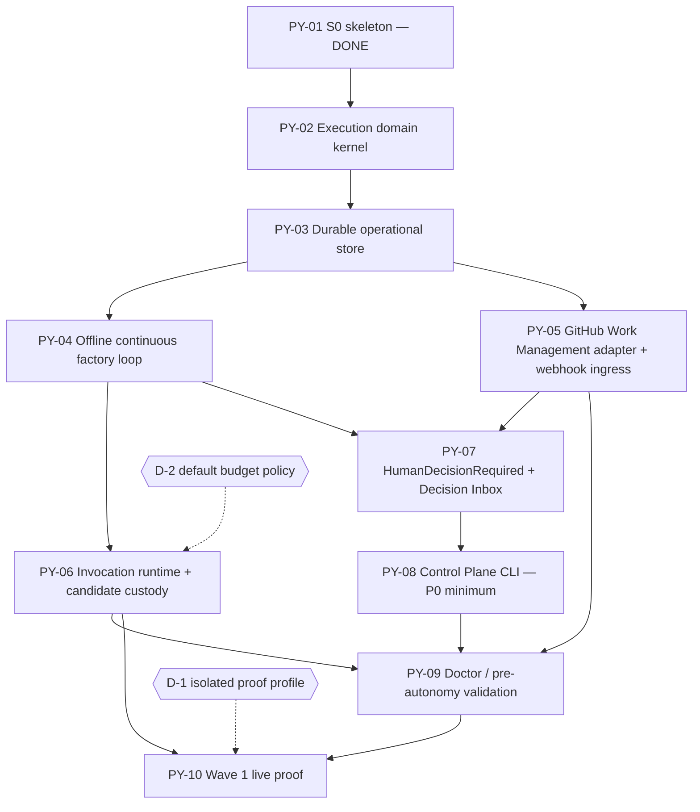

# Wave 1 PLAN — proposed dependency DAG and BIU decomposition

Date: 2026-09-19. Status: **PROPOSED — for Founder review.** No BIU is created, TASKS/READY, or implemented by this document.
Authority:
- [Software-factory plan](../decisions/alienintent-software-factory-plan.md)
- [Wave 1 Founder decisions SWF-01–07](../decisions/2026-09-19-software-factory-wave1-founder-decisions.md)
- [Architecture Authority](../architecture/alienintent-architecture-authority-2026-09-19.md) (AA)
- FD-01–FD-06
- EOS v1.0
- `docs/architecture/pre-python-gate/` contracts (gate-reclassified A/B)

Inputs: [Wave 1 planning cohort](sf-wave1-planning-cohort.md). Requirements SF-REQ-001–010, 034 (P0 minimum), 035, 038 are Issues #3–#14 and #16 in Project Status PLAN.

## Objective

Build the shortest coherent path to this outcome: a prioritized READY backlog is continuously consumed by AlienIntent. Consumption respects priority, dependency eligibility, WIP, execution capacity and real human-authority blockers. No human triggers individual BIUs.

## Planning constraints taken from authority

1. **Python only (SWF-01).** All Wave 1 capability lives in `src/alienintent` under the FD-02 modules and PY-01 layering. The Node bootstrap only executes these BIUs; Node changes are limited to §42 critical repairs.
2. **FD-01 ownership split.** GitHub Projects stays canonical for CAPTURE–READY and priority. AlienIntent owns execution after explicit release. Downstream Project fields are projections, never execution authority.
3. **Release (FD-03, AA §10).** Automatic release defaults ON and is configurable OFF. Both paths cross one release boundary with readiness, dependency, capability and budget guards. READY alone never launches a worker.
4. **No polling (AA §21, event-ingress).**
   - The READY view stays current through authenticated upstream events.
   - Capacity refill is driven by internal events (reservation released, result recorded).
   - One reconcile snapshot at startup is recovery, not a periodic listing.
5. **Durability (FD-05).** Inbox/effect-intent/outbox, expected versions, reservation fencing, idempotent effects and read-back for unknown outcomes. SQLite is the default (AA §16).
6. **One writer per profile (conformance-and-sovereignty).** Python and Node never both mutate one profile. Node dispatches on IMPLEMENT/VERIFY/ACCEPT in the AlienIntent Project, so a Python-projected IMPLEMENT there would also launch Node. The Wave 1 live proof therefore needs an isolated profile (decision D-1 below). Running AlienIntent's own backlog on Python is a cutover and is outside Wave 1.
7. **Priority is input (SWF-03).**
   - Scheduling reads the Project **Priority** field.
   - Items with no priority are FIFO among equals.
   - **Wave** is grouping metadata, never a scheduling input.
   - Dependencies come from native GitHub blocked-by.
8. **EOS discipline.** One active vertical (rule 2), executable proof of the real path (rule 6), and monotonic accepted progress from S0 (rule 9). Hence a walking skeleton (PY-04) that the later BIUs thicken.
9. **Installability is a constraint, not a deliverable (SWF-04).** Typed profile configuration and secret references are built only where a Wave 1 BIU consumes them. There is no `alienintent init`.

## Dependency DAG

Critical path: PY-02 → PY-03 → PY-04 → PY-06 → PY-09 → PY-10, with PY-07 → PY-08 joining at PY-09.

At the default WIP of one mutating stream, the proposed execution order is:
**PY-02, PY-03, PY-04, PY-05, PY-06, PY-07, PY-08, PY-09, PY-10.**

- PY-05 is independent of PY-04, and PY-07 of PY-06, so they may run concurrently if WIP is raised.
- All BIUs inherit **P0** from their requirements. The order comes from technical dependencies only, not new priority.

## Requirement → BIU traceability

| Requirement | Primary BIU | Contributing |
|---|---|---|
| SF-REQ-001 Continuous execution | PY-04 | PY-05 (event freshness), PY-10 (live proof) |
| SF-REQ-002 READY scheduling | PY-02 (policy) | PY-04, PY-05 (Priority/blocked-by import) |
| SF-REQ-003 Solve for N | PY-02 (limits) | PY-03 (atomic reservations), PY-04 |
| SF-REQ-004 Rolling slot refill | PY-04 | PY-03 |
| SF-REQ-005 Work Management abstraction | PY-05 | PY-04 (port + in-memory adapter) |
| SF-REQ-006 Human decision escalation | PY-07 | PY-02 (blocked state) |
| SF-REQ-007 Candidate custody | PY-06 | PY-02 (VERIFY-entry guard) |
| SF-REQ-008 Crash-safe execution | PY-03 | PY-04, PY-05 (ingress custody), PY-10 |
| SF-REQ-009 Deterministic kernel | PY-02 | PY-06 (capabilities/budgets), fitness checks |
| SF-REQ-010 BIU contract model | PY-02 | PY-05 (upstream serialization) |
| SF-REQ-034 Control Plane (P0 minimum) | PY-08 | — |
| SF-REQ-035 Decision Inbox | PY-07 | PY-08 (CLI surface) |
| SF-REQ-038 Doctor / validation | PY-09 | — |

## Proposed BIUs

Each BIU below is a draft outline. It would be written to `docs/work-units/python/PY-0N.md` in the PY-01 format (intent, architecture references, binding rules, scope, non-goals, acceptance, verification, readiness) and assessed by Agent-Ready before TASKS/READY.

Standing non-goals for every BIU: no Node change, no FactoryChecks change, no installer, no Wave 2+ capability.

### PY-02 — Execution domain kernel (pure)
- **Satisfies:** 010, 002/003 (policy), 007 (guard), 009 (partial).
- **Module:** `execution_coordination/domain`.
- **Scope:**
  - Versioned, digest-identified **BIU contract** value model. It covers every plan §BIU field: intent, requirement links, fixed decisions, boundaries, dependencies, capabilities, budget, completion criteria, verification and evidence obligations, non-goals, candidate custody, release policy. It also carries the work-and-release fields: authority issuer, target repositories/baselines, retry policy, closure actions, stop/escalation conditions.
  - **Release** and **admission** rules.
  - **Execution lifecycle** state machine: IMPLEMENT → VERIFY → REVIEW → ACCEPT → closure → DONE. Rework returns to IMPLEMENT. Blocked and cancelled are exceptional outcomes, and an authority block is distinct from a failure.
  - Candidate-custody guard: VERIFY is inadmissible without a durable, retrievable candidate identity.
  - **Scheduling policy** as a pure function: eligible = released-or-releasable READY, dependencies satisfied, capacity available. Order is priority, then FIFO. Limits are global, profile and repository; the default is one mutating stream per repository.
  - Verdict admissibility: worker self-reports are observations, never verdicts.
- **Fitness:** extend PY-01 checks so domain/application cannot read wall-clock, randomness or ID generation except through Clock/Identifier ports. This is the mechanical part of "no LLM or nondeterminism owns canonical state".
- **Non-goals:** I/O, persistence, adapters, CLI.
- **Acceptance:** table-driven tests for every guard and ordering rule, including equal/absent priority FIFO, a blocked dependency skipped while independent work proceeds, WIP saturation, duplicate release, and a stale-version transition rejected. Fitness passes on the tree and fails on violating fixtures.

### PY-03 — Durable operational store
- **Satisfies:** 008; atomic reservations for 003/004.
- **Module:** `execution_coordination/ports` + `adapters` (SQLite, stdlib).
- **Scope:**
  - OperationalStore port: expected-version commits.
  - Inbox receipts with deduplication by event identity.
  - Effect-intent/outbox with read-back state.
  - Reservations with fencing tokens (global/profile/repository).
  - Versioned schema with fail-closed migration.
  - Store conformance suite written so a later PostgreSQL adapter runs the same cases.
- **Non-goals:** PostgreSQL adapter; evidence/trajectory stores (Wave 5).
- **Acceptance:** crash-boundary tests (process killed between receipt, transition, effect and receipt-of-effect) show no lost owner and no duplicate effect. A stale fence cannot release a newer reservation. Concurrent admission for one repository yields exactly one reservation.

### PY-04 — Offline continuous factory loop (walking skeleton)
- **Satisfies:** 001, 004; integrates 002/003/008.
- **Module:** `execution_coordination/application`, `composition`.
- **Scope:**
  - FactoryCoordinator application service: import READY view → policy release (ON/OFF) → admission + reservation → dispatch through the WorkerProvider port → correlated result → lifecycle progression → closure → DONE.
  - Rolling refill on capacity-release events.
  - Explicit stop conditions: backlog exhausted, all remaining work blocked, or authority required.
  - WorkManagement and WorkerProvider **ports**, each with an in-memory/scripted **test adapter**.
- **Non-goals:** real GitHub, real workers. The scripted worker is a test adapter, not SF-REQ-039 (Wave 2).
- **Acceptance:** from one start command, a seeded backlog of ≥5 BIUs is consumed to exhaustion.
  - Order honors priority, FIFO, blocked-by and WIP.
  - A restart mid-run on SQLite resumes without duplicate dispatch or lost results.
  - No timer-driven listing of the backlog.

### PY-05 — GitHub Work Management adapter + webhook ingress
- **Satisfies:** 005; event freshness for 001; ingress custody for 008.
- **Module:** `execution_coordination/adapters` (WM ACL), `installation` (typed profile + file-reference SecretProvider, minimal), `composition`.
- **Scope:**
  - ACL imports noncanonical READY snapshots with provider/version provenance. The imported fields are Status mapping, **Priority** field, native **blocked-by**, the BIU contract location/digest, and the Agent-Ready receipt.
  - Release proposal.
  - Downstream projection with revision fencing.
  - Direct-webhook EventIngress: authenticated raw body, durable receipt before acknowledgment. It translates Project item, Issue and dependency changes into neutral upstream-change notifications.
  - Startup reconcile snapshot.
  - Fail closed on ambiguous mapping, missing membership or incomplete pages.
- **Non-goals:** outbound relay adapter (FD-04 transport, not needed for the Wave 1 minimum), Jira/GitLab, writing priority.
- **Acceptance:** contract tests against recorded payload fixtures, including forged signature, duplicate delivery, reordered stale event, missing Priority (→ unprioritized FIFO) and an external IMPLEMENT/ACCEPT edit (→ drift, no execution change). No vendor type crosses the port (PY-01 fitness).

### PY-06 — Invocation runtime and candidate custody
- **Satisfies:** 007; 009 (capabilities/budgets); 003 (isolation).
- **Module:** `invocation_runtime`.
- **Scope:**
  - Workspace port with one git worktree per invocation and owner-scoped cleanup.
  - SourceControl port: immutable revision, candidate publication, fresh read-back.
  - WorkerProvider CLI adapter(s) wrapping the provider CLIs Node uses today.
  - FD-03 capability profiles plus BIU-specific grants.
  - Timeouts, cancellation protocol, bounded retries.
  - Budgets that fail closed, where unknown consumption is not zero.
  - Custody gate: VERIFY is admitted only after the candidate commit is published and read back by a fresh, independent checkout.
  - Verifier invocation with separate worktree, context and provenance (AA §5).
- **Non-goals:** cheapest-capable routing (Wave 4), sandbox backends, deployment capabilities.
- **Acceptance:**
  - Producer→verifier handoff on a real local repository with an exact SHA.
  - An unpublished candidate cannot enter VERIFY.
  - Cancel preserves evidence and releases the reservation.
  - Budget exhaustion blocks, never overruns.
  - A path that cannot measure a required hard limit is ineligible.
- **Blocked on D-2.**

### PY-07 — HumanDecisionRequired and Decision Inbox
- **Satisfies:** 006, 035.
- **Module:** `execution_coordination` (domain event + policy), `control_plane` (inbox application service).
- **Scope:**
  - `HumanDecisionRequired` carries the plan §Human escalation fields: project, BIU, decision, why blocked, options, tradeoffs, recommendation, affected requirements/architecture, cost of waiting, what each choice authorizes.
  - Affected work = the BIU plus its transitive dependents. Its mutating reservation is released while it waits; its workspace is retained. Independent work continues.
  - The Decision Inbox is an operational-store view.
  - A decision is recorded as a durable, attributable authority record and emits `DecisionRecorded`, which automatically re-admits the affected work.
  - Notification port, with a WM projection adapter (Issue comment) as the first notifier. No polling.
- **Acceptance:** with three BIUs, one escalates while the other two complete. Recording the decision unblocks and completes it without a restart. A duplicate decision submission is idempotent. A stale decision against a superseded BIU version is rejected.

### PY-08 — Operator Control Plane CLI (P0 minimum)
- **Satisfies:** 034 (P0 minimum), 035 (surface).
- **Module:** `control_plane`, `composition`.
- **Proposed P0 minimum:**
  - `run` / `stop` for the service
  - `status`
  - `explain <biu>` (deterministic account of guards and evidence)
  - `cancel`
  - `reconcile` / `resume`
  - `decisions list|show|decide`
  - `doctor` (entry point implemented in PY-09)
- **Output:** human-readable and JSON, with nonzero exit on error.
- Every mutating command goes through application services with actor, expected version and idempotency key; there is no state-edit backdoor (AA §36).
- **Deferred to SF-REQ-034 polish / Wave 6:** replay, synthetic-event emit, cost/routing/grant inspection, web UI.
- **Acceptance:** each command runs against the PY-04/07 system. An unauthorized or stale mutation is denied. `explain` reproduces guard outcomes exactly.

### PY-09 — Doctor / pre-autonomy validation
- **Satisfies:** 038.
- **Module:** `installation`, `control_plane`.
- **Scope:** `alienintent doctor` validates:
  - profile configuration and secret references
  - Work Management access and field mapping (Status options, Priority field)
  - source-control access
  - provider readiness probes
  - webhook route/secret health
  - persistence schema
  - execution capability
- `run` refuses autonomous start unless doctor passes, and reports sanitized causes (live process vs. ready dependencies).
- **Acceptance:** each check has a failing and a passing case; no secret appears in output; a failed check prevents autonomous start.

### PY-10 — Wave 1 live proof
- **Satisfies:** the Wave 1 outcome for all cohort requirements.
- **Scope:** on the isolated profile from D-1, a prioritized READY backlog of at least three small BIUs is consumed from one `run` through DONE with no per-BIU trigger. The backlog includes:
  - different priorities
  - one blocked-by dependency
  - one deliberate HumanDecisionRequired
- The run also includes a mid-run service restart and exact candidate/verification evidence per BIU.
- **Non-goals:** running AlienIntent's own backlog on Python (that is cutover/Sovereignty and needs separate Founder approval); Node retirement.
- **Acceptance:** retained evidence of ordering, refill, restart without duplicate effects, escalation and automatic resumption, and independent verification. Doctor passes before start.

## Decisions surfaced (not blocking PY-02 to PY-05)

**D-1 — Isolated execution target for the Python factory.**
- **Why it matters:** PY-10 needs real GitHub execution without two writers on one profile. Node's App installation is scoped to exactly one repository, and it dispatches on the AlienIntent Project. The choice touches operational authority, identity and the trust boundary (AA §45).
- **Options:**
  - (a) a dedicated sandbox repository plus its own Project, with a separate Python GitHub App installation and webhook route;
  - (b) run PY-10 against the AlienIntent Project with Node stopped (this is effectively a cutover rehearsal);
  - (c) keep PY-10 local only, with a real git remote and a recorded GitHub fixture.
- **Recommendation:** (a). It proves the real path (EOS rule 6) without touching Node authority.
- **Needed before:** PY-10 reaches READY.

**D-2 — Default Wave 1 budget policy for CLI worker providers.**
- **Why it matters:** FD-03 makes a path ineligible if policy requires a hard limit the provider cannot enforce or measure. The provider CLIs enforce wall-clock time and attempts, but not token ceilings. A default that requires token hard limits would make every current worker path ineligible. Cost policy is Founder-reviewed (AA §45).
- **Recommendation:** hard limits on wall-clock time, attempts and retries per BIU and per profile. Measure token spend and record it where the provider reports it (unknown ≠ zero). Token ceilings apply only where a provider can enforce them.
- **Needed before:** PY-06 reaches READY.

Nothing else found requires Founder authority. Remaining gaps are category-B design detail completed inside the BIUs above:
- port signatures
- FIFO key: upstream READY-entry time observed through the ACL, falling back to receipt order
- verifier invocations: excluded from the mutating limit but counted against global capacity
- dependency webhook event mapping
- schema details

## Next steps after review

1. Write PY-02–PY-10 as BIU contracts in `docs/work-units/python/`.
2. Assess each with Agent-Ready.
3. Materialize them as BIU Issues linked to their SF-REQ Issues (sub-issue or blocked-by, native only).
4. Move them through TASKS → READY in dependency order.
5. Record D-1 and D-2 when decided.
